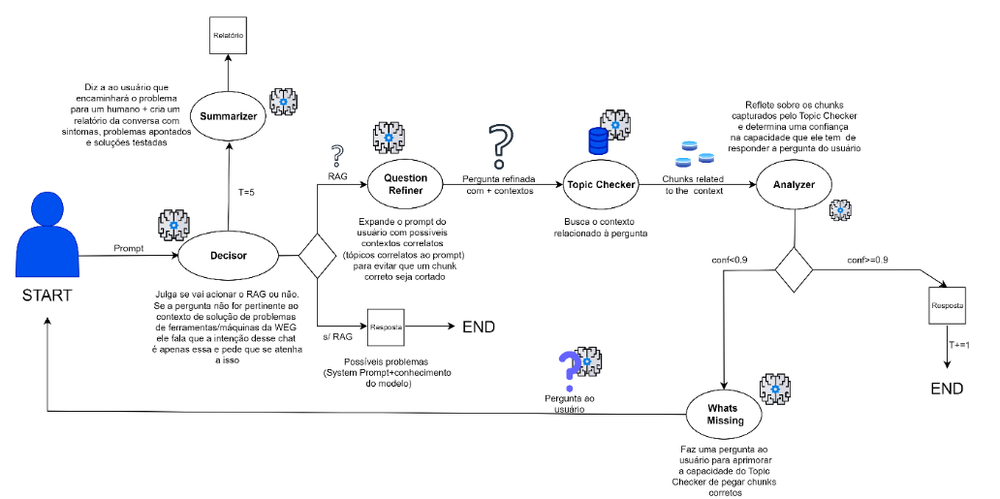

# Implementação and Architectural Details

O chatbot foi implementado utilizando a biblioteca **LangGraph** para orquestrar o fluxo de decisão e refinamento das perguntas, garantindo que o bot formule perguntas de alto valor sempre que necessário, consiga responder perguntas de acordo com manuais técnicos e um FAQ da WEG quando julgar possuir capacidade para tal (confiança acima de 0,9) e realize o handoff automático para suporte humano quando necessário.

## Como rodar

No terminal, dentro da pasta `chatbot-local`, rode:

```bash
uvicorn app.main:app --reload --host
```

Ou se preferir (Recomendamos), pode subir um container Docker:

```bash
docker build -t weg-chatbot .
docker run -p 8000:8000 weg-chatbot
```

## Arquitetura da Solução

Diante do problema inicial trazido pela WEG, foi proposto um diagrama arquitetural, no qual o fluxo foi estruturado para comportar uma solução enxuta, direta e ajustada às necessidades do cliente.

<p align="center">
  
</p>
<p align="center"><em>Figura 1 – Arquitetura v1</em></p>

Com essa arquitetura, chegou-se à versão **v1** que se introduz um grafo operacional governado por um nó **Decisor**, responsável por controlar o uso do RAG, contabilizar tentativas (T) e definir desvios de fluxo. Em paralelo, os nós **Question Refiner**, **Topic Checker** e **Analyzer** trabalham em conjunto para maximizar a recuperação correta de informações e mensurar a confiança das respostas.

Quando a confiança calculada fica abaixo de um limiar (threshold) de **90%**, o módulo **Whats Missing** é ativado e formula uma pergunta estratégica ao usuário para suprir lacunas informacionais. Caso o ciclo persista sem resolução após várias interações, o nó **Summarizer** compila um relatório estruturado em Markdown para **handoff humano**.

## Detalhes de cada um dos módulos necessários para a implementação dessa arquitetura

### Chatbot Graph

Este módulo implementa um fluxo conversacional com **LangGraph**, integrando **Azure OpenAI**, **Chroma** (RAG) e **ferramentas** para recuperação de contexto e controle de estado.

### Visão Geral

- **Modelo**
- **Vector Store**: Chroma (`example_collection`) com `retriever(k=5)`.
- **Memória/Checkpoint**: `InMemorySaver` com `thread_id="1"`.
- **Controle de handoff**: `T` e `STOP_TRYS` limitam tentativas antes do **handoff**.

### Ferramentas

- `retrieve_documents(query)`: busca trechos relevantes no Chroma e retorna texto **limpo**.
- `rewind_state(query)`: retrocede o estado para um checkpoint com `len(messages)==N`.

### Prompts do Sistema (principais)

- **Decisor**: agente humano/empático; chama RAG se tema WEG for detectado.
- **QuestionRefiner**: reescreve a pergunta (1–2 frases) para melhorar a recuperação.
- **RAG**: **não** responde ao usuário; organiza JSON com tópicos e chunks verbatim.
- **WhatsMissing**: pergunta **somente** o que falta para atingir confiança ≥ 0,90.
- **Summarizer**: encerra com handoff humano e gera relatório em Markdown.

### Helpers (resumo)

- `summarize_conversation(messages, k)`: resume últimas interações e compacta histórico.
- `history_retriever(messages)`: concatena conteúdos em texto único.
- `question_refiner(question, history)`: aplica o prompt de refinamento.
- `last_human_question / last_rag_json / last_retrieve_context`: utilidades de contexto.
- `last_confidence_and_reason`: extrai `{confidence, justificativa}` do `conf_analyzer`.

### Nós do Grafo

- `decisor` → decide entre **tool_call** (RAG) ou resposta direta.
- `question_refiner` → ajusta query antes da busca.
- `topic_checker` → executa tools, organiza `CONTEXT` e chama RAG.
- `analyzer` → estima confiança (0–1); com ≥ 0,90 pode **responder** direto.
- `whats_missing` → coleta dados faltantes quando confiança < 0,90.
- `summarizer` → handoff humano + relatório estruturado.

### Regras de Encaminhamento

- `decisor`:
  - **Sem tool_call** → **END** (resposta direta).
  - **Com tool_call** → `question_refiner`.
  - **T atingiu STOP_TRYS** → `summarizer`.
- `analyzer`:
  - `confidence ≥ 0,90` **e** `T < STOP_TRYS` → **END** (resposta final).
  - Caso contrário → `whats_missing` → **END**.

### Execução (CLI)

- `stream_graph_updates(user_input)`: imprime eventos (confiança, resposta final, follow-up, handoff).
- Loop interativo `while True`: lê entrada, processa e exibe saídas do grafo.

---

### Populate Database

Este módulo é responsável por carregar e indexar documentos no Vector Store, com suporte a arquivos PDF e CSV.

#### PDFs:

- Os documentos em PDF são fragmentados em chunks por meio de um text splitter, respeitando tamanho máximo e sobreposição configurados.

- Cada chunk recebe um ID único no formato:

```py
source:page:chunk_index

```

#### CSVs:

- Os arquivos CSV são lidos linha a linha, utilizando ; como delimitador de colunas.

- Diferente dos PDFs, os CSVs não são fragmentados.

- Cada linha recebe um ID fixo no formato:

```py
source:row:0
```

#### Indexação e Persistência

##### Após o processamento:

1. Os documentos (chunks de PDFs e linhas de CSVs) são reunidos.

2. O sistema verifica se já existem documentos no Chroma Vector Store.

- Apenas documentos ainda não indexados são adicionados, evitando duplicidade.

3.  Quando novos documentos são identificados, eles são adicionados e persistidos na base.

Esse processo garante que o armazenamento vetorial esteja sempre atualizado, incorporando novos conteúdos sem recriar ou duplicar registros já existentes.

---
